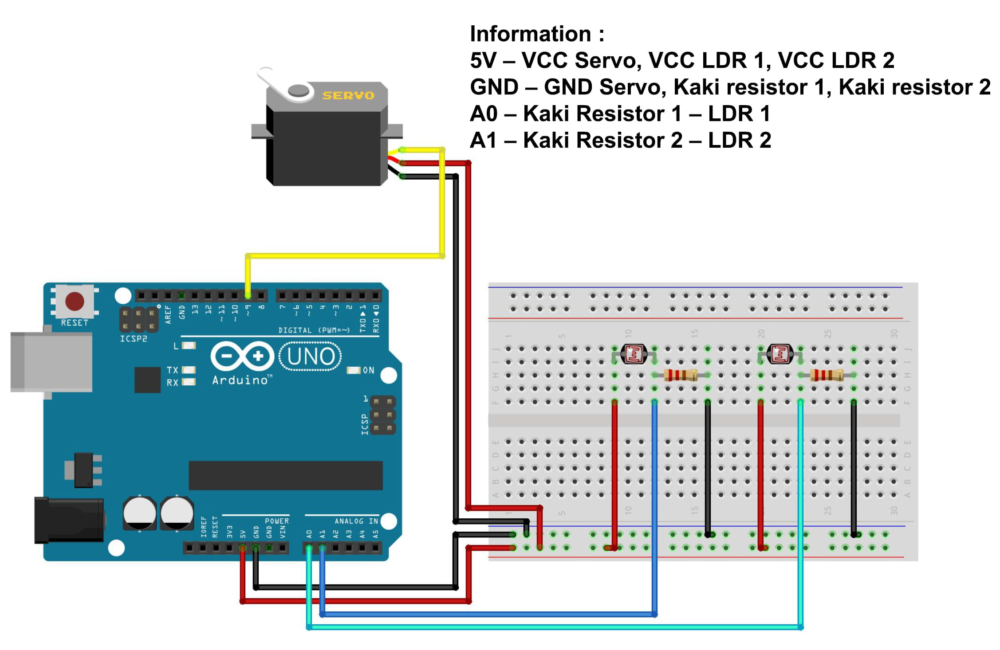

# Simple Solar Tracker with Arduino Uno and LDR Sensor

This project demonstrates how to build a simple solar tracker using an Arduino Uno, two LDR (Light Dependent Resistor) sensors, and a servo motor. The system adjusts the position of a solar panel to maximize sunlight exposure by detecting light intensity differences between the two LDRs.

## Components Used
- Arduino IDE or Text Editor example --> VisualStudio Code;
- Library: Servo;
- Arduino Uno (or compatible board) = 1 Unit;
- Servo Motor (Type SG90) = 1 Unit;
- LDR (Light Dependent Resistor) Sensor = 2 Units;
- Resistors (220 ohm (Ω)) = 2 Units;
- Project Boar / Breadboard = 1 Unit;
- Jumper Wires.

# Schematic:

- Below you can see a schematic image to facilitate the wiring of cables from the microcontroller to devices, both input and output sensors:

## Circuit Diagram

- **LDR1:** Connect one leg to 5V and the other leg to analog pin A0 with a 220Ω resistor to GND.
- **LDR2:** Connect one leg to 5V and the other leg to analog pin A1 with a 220Ω resistor to GND.
- **Servo Motor:** Control pin to digital pin D9, VCC to 5V, and GND to GND.

## Work steps

- Prepare the tools and materials to be used.
- Carry out the wiring process using Figure schematic of the above circuit.
- Open the Arduino IDE software that has been installed on laptop/computer.
- Download all the libraries above and insert the library by opening the Arduino IDE, selecting Sketch > Include Library -> Add.Zip Library.
- Type the sketch program on the Arduino IDE page.
- Carry out the program uploading process.

## How It Works

- The system uses two LDRs to measure light intensity.
- The servo motor adjusts the position of the solar panel based on the light intensity difference between the two LDRs.
- If LDR1 detects more light than LDR2, the servo motor rotates the panel towards LDR1, and vice versa.
- The position is adjusted within the range of 0 to 180 degrees to optimize sunlight exposure.

## Code Explanation

- The `Servo` library is used to control the servo motor.
- The LDRs provide analog inputs, which are read by the Arduino and mapped to a range between 0 and 180 degrees.
- The code continuously adjusts the servo position based on the difference in light intensity between the two LDRs.

## Installation

1. Assemble the components as described in the circuit diagram.
2. Upload the provided code to your Arduino using the Arduino IDE.
3. Place the setup in a location where it can track sunlight.

## Usage

- Power on the system.
- The servo motor will automatically adjust to track the sun, maximizing the solar panel's exposure to light.

## Conclusion

- This simple solar tracker helps in maximizing the efficiency of a solar panel by keeping it aligned with the sun throughout the day, making it an ideal project for renewable energy enthusiasts.

- The program works when the sensor starts to detect it light. When the sensor starts to detect the servo light will move in the direction of the light movement detected by the LDR sensor.

#### @Copyright 2024 | Simple-Solar-Tracker-with-Arduino-Uno-and-LDR-Sensor
"# Simple-Solar-Tracker-with-Arduino-Uno-and-LDR-Sensor" 
